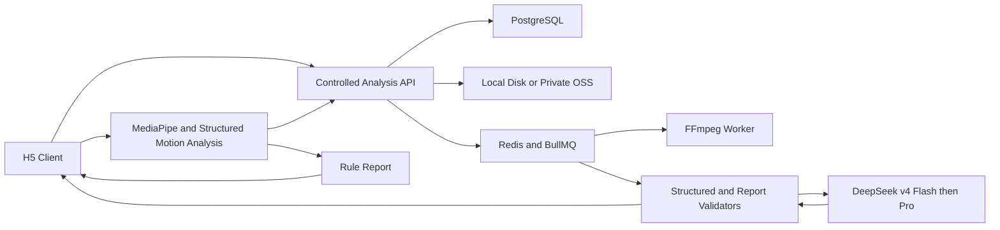

# DanceMirror v0.4 Design

## Overview

本设计采用“H5 复用现有分析算法 + 受控异步服务”。正式任务由后端统一管理上传、转码、状态、模型调用、持久化和删除；首版姿态与音轨分析仍复用已经验证的浏览器模块，等待真实视频压测后再决定是否迁入 Worker。

## Steering Alignment

- 产品：保持无登录单页，只实现上传—处理—比对—报告闭环。
- 技术：复用当前原生 JavaScript 与 Vitest，不在首个里程碑更换前端框架。
- 结构：`app.js` 只做编排，schema、API client、任务状态和分析 provider 独立。

## Code Reuse Analysis

- `services/appState.js`：复用文件校验、启动条件和任务版本机制。
- `services/audioAlignment.js`：作为音轨算法 POC 和服务端实现的对照基线。
- `services/subjectTracker.js`：复用目标不可信时“丢失而非换人”的规则。
- `services/feedbackGenerator.js`：作为非大模型兜底报告生成器。
- `services/comparisonApiClient.js`：使用同源 API 作为唯一浏览器网络边界。
- `components/DualVideoPlayer.js`：继续承担共享时间轴播放。

## Architecture



## Components and Interfaces

### Report Schema Validator

- 输入：未知来源报告对象、共享时长。
- 输出：`{ valid, value, errors }`。
- 责任：验证版本、必填字段、问题数量、排序、时间范围、枚举和禁用评分字段。

### Comparison API Client

- `createSession()`
- `uploadVideo(sessionId, role, file, signal, onProgress)`
- `getSession(sessionId)`
- `startAnalysis(sessionId)`
- `getAnalysis(taskId)`
- `cancelTask(taskId)`
- `deleteSession(sessionId)`

客户端只消费标准状态和错误码，不读取供应商模型信息。

### Analysis Service

- PostgreSQL 保存匿名 session、video、task、结构化分析和 report 状态。
- Redis/BullMQ 保存媒体准备与报告生成任务，API 与 Worker 分进程运行。
- 本地磁盘和 OSS 通过同一接口生成短期签名 URL；OSS 内部对象操作允许走深圳内网，浏览器签名 URL 使用公网。
- 每次写操作检查 session token 与资源版本。
- DeepSeek 只改写规则报告文案，不允许改变问题证据、时间或严重度。

## Data Models

### Session

```text
id, tokenHash, status, teacherVideoId, userVideoId,
alignmentId, subjectSelections, activeTaskId, createdAt, expiresAt
```

### AnalysisTask

```text
id, sessionId, inputVersion, status,
stage, structuredReport, finalReport, errorCode,
createdAt, updatedAt, cancelledAt
```

### Storage lifecycle

```text
sessions/{sessionId}/teacher/*
sessions/{sessionId}/user/*
sessions/{sessionId}/analysis/*
```

用户主动删除立即清理整个前缀和数据库记录；周期 Cleanup 每小时扫描一次，删除超过 24 小时的会话。OSS 生命周期规则仅作为 2 天兜底。

### Report v1

使用 `docs/AI_SPEC.md` 的教练卡字段，新增 `schemaVersion` 和稳定 `id`。前端兼容期允许把旧字段标准化为 v1，但服务端输出必须直接符合 v1。

## State and Concurrency

- 客户端保留 `taskVersion`，每次替换、取消、重启分析时递增。
- 服务端 task 绑定 `inputVersion`；视频版本变化后旧 task 自动 stale。
- `cancelled/stale/deleted` 为终态，后续 provider 结果不得覆盖。
- 模型失败仅改变 `analysis.status` 为 `fallback`。

## Error Handling

- 文件错误：`invalid_format`、`too_large`、`too_long`、`decode_failed`。
- 服务错误：`upload_failed`、`transcode_failed`、`service_unavailable`。
- 媒体错误：`teacher_audio_missing`、`subject_not_found`、`alignment_failed`。
- 报告错误：`report_schema_invalid`，自动走已校验 fallback。
- 权限错误：`session_not_found`、`session_token_invalid`、`session_expired`。

## Testing Strategy

- Contract：有效/无效报告、模型异常、fallback 一致性。
- Unit：状态转换、任务取消、迟到结果、错误码映射。
- Integration：创建会话—上传—轮询—取消—删除。
- E2E：标准路径、多人路径、手动校准、模型 fallback、任务替换。
- Infrastructure：PostgreSQL migration、Redis job persistence、OSS private ACL/签名 URL、24 小时清理。
- Mobile：375/390/430 宽度和 Safari/Chrome/WeChat 关键媒体行为。

## UI Delivery Baseline

当前可交互 Demo 是本版本唯一 UI 实现基线。后续开发直接复用现有页面结构、组件、样式变量和交互状态，以 `docs/UI_SPEC.md` 补充异常与边界状态；不再把 Figma 作为开发前置条件或验收依赖。功能实现不得为等待设计稿而暂停，也不得借机重做已经确认的页面方向。
